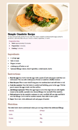
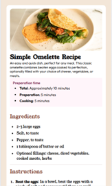

# Frontend Mentor - Recipe page solution

This is a solution to the [Recipe page challenge on Frontend Mentor](https://www.frontendmentor.io/challenges/recipe-page-KiTsR8QQKm). Frontend Mentor challenges help you improve your coding skills by building realistic projects. 

### Screenshot

### Links

- Solution URL: [https://github.com/toshirokubota/front-mentor-recipe-page](https://github.com/toshirokubota/front-mentor-recipe-page)
- Live Site URL: [https://toshirokubota.github.io/front-mentor-recipe-page/](https://toshirokubota.github.io/front-mentor-recipe-page/)

## My process

### Built with

- Semantic HTML5 markup
- CSS custom properties
- Box-model
- media query
- viewport unit

### What I learned
I was able to use more complex CSS selectors.

I was able to use the viewport unit to control the width of the page for mobile devices.

### Continued development

I have not use flex or grid layouts, yet, in my challenge assignments. I probably want to take them up soon. However, I am still not 100% confident with the box model (and not at all with float), so I also want to gain more experience with it.

When there was a bug in my CSS and the style collapses, I could not refresh the view and get it working after fixing the bug. I had to close the page and re-open it to have the fix taken effect. Is it typical, or is there something in my code for the behavior?

### Useful resources

## Author

